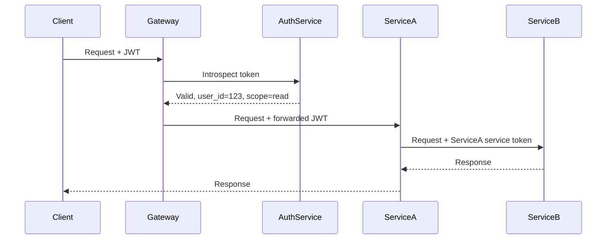

# Cross-Service Authentication Flow Diagram

This skill traces and documents how authentication tokens originate, propagate, and are validated across microservices, surfacing security gaps and performance bottlenecks in the process.

## Workflow

### 1. Gather Service Inventory
- Ask the user to list all services involved (or extract from codebase/config files)
- Identify entry points: API gateways, BFFs, public endpoints
- Identify internal service-to-service calls (REST, gRPC, message queues, etc.)
- Note any third-party identity providers (Auth0, Cognito, Okta, etc.)

### 2. Trace Token Lifecycle
For each service boundary, document:
- **Token type**: JWT, opaque token, session cookie, API key, mTLS cert
- **Token origin**: Where is it issued? (IdP, auth service, gateway)
- **Propagation method**: Authorization header, forwarded header, re-issued downstream token, service account credential
- **Validation location**: Each service that validates vs. passes through blindly
- **Expiry and refresh behavior**: TTL, refresh token usage, rotation strategy

### 3. Identify Each Hop
Walk the request path from client to deepest internal service:
```
Client → Gateway → Service A → Service B → Database/External API
```
At each arrow, answer:
- Is a token present?
- Is it validated here or forwarded?
- Is a new token issued or the original reused?
- What happens on validation failure?

### 4. Flag Issues
Mark each hop with one of:
- 🔴 **Security gap**: No auth, token forwarded without validation, overprivileged scope
- 🟡 **Latency source**: Synchronous token introspection call, no caching, repeated validation
- 🟠 **Fragility risk**: Single point of failure, no fallback, hard-coded credentials
- 🟢 **Healthy**: Validated, scoped, cached appropriately

### 5. Check for Common Anti-Patterns
- Token forwarding without re-scoping (ambient authority problem)
- Synchronous calls to a central auth service on every request (latency + SPOF)
- Services trusting internal network position instead of token validation
- Long-lived tokens with no rotation
- Missing token propagation on async/queue-based flows

## Output Format

Produce the following sections in order:

**1. Flow Diagram (ASCII or Mermaid)**


**2. Hop-by-Hop Table**
| Hop | Token Type | Validated? | Method | Issues |
|-----|-----------|------------|--------|--------|
| Client → Gateway | JWT | ✅ Yes | Introspection | 🟡 No cache |
| Gateway → Service A | JWT (forwarded) | ❌ No | Header passthrough | 🔴 Gap |
| Service A → Service B | Service account | ✅ Yes | mTLS | 🟢 Healthy |

**3. Issue Summary**
- List all 🔴 🟡 🟠 findings with a one-line description and recommended fix

**4. Recommendations**
- Prioritized list (Critical → High → Medium) with specific, actionable fixes
- Include concrete implementation suggestions (e.g., "add token validation middleware in Service A using the existing `auth-lib` package")

Length:
