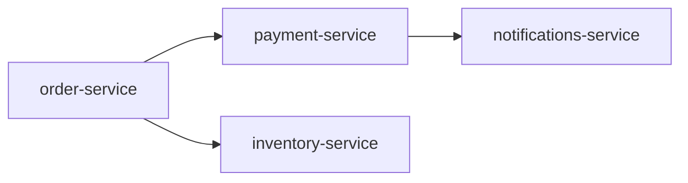

# Service Dependency Graph Generation

This skill scans a codebase to identify all inter-service calls and shared resources, then produces a structured or visual dependency graph showing how components relate to one another.

## Discovery Workflow

1. **Identify service boundaries** — Locate all services, modules, or applications in the repo. Look for distinct directories, `package.json` files, Dockerfiles, Kubernetes manifests, or service config files.

2. **Scan for outbound calls** — Search for HTTP clients (`fetch`, `axios`, `requests`, `HttpClient`), gRPC stubs, message queue publishers/subscribers, and SDK calls. Extract target hostnames, environment variable references (e.g., `ORDER_SERVICE_URL`), and hardcoded endpoints.

3. **Identify shared resources** — Find shared databases (connection strings, ORM config), caches (Redis, Memcached), message brokers (Kafka topics, SQS queues, RabbitMQ exchanges), and object storage buckets referenced across multiple services.

4. **Resolve environment variables** — Cross-reference `.env`, `docker-compose.yml`, Helm values, and Terraform outputs to map variable names to actual service names where possible.

5. **Detect indirect dependencies** — Find shared libraries or internal packages imported by multiple services; note these as shared code dependencies.

6. **Build the edge list** — For each dependency found, record: `source_service → target_service`, `dependency_type` (sync HTTP, async event, shared DB, shared cache, shared library), and `evidence` (file path + line number).

7. **Flag risks** — Note circular dependencies, services with high fan-in or fan-out (more than 5 edges), and undocumented or ambiguous dependencies.

## Output Format

Produce three sections:

**1. Dependency Edge List (table)**
| Source Service | Target Service | Dependency Type | Evidence |
|---|---|---|---|
| order-service | payment-service | sync HTTP | `src/order/client.ts:42` |

**2. Mermaid Graph**

**3. Summary**
- Total services identified: N
- Total dependency edges: N
- Shared resources: list each with consuming services
- Risk flags: circular deps, high-coupling services, unresolved endpoints
- Confidence notes: list any assumptions made due to dynamic resolution or missing config
